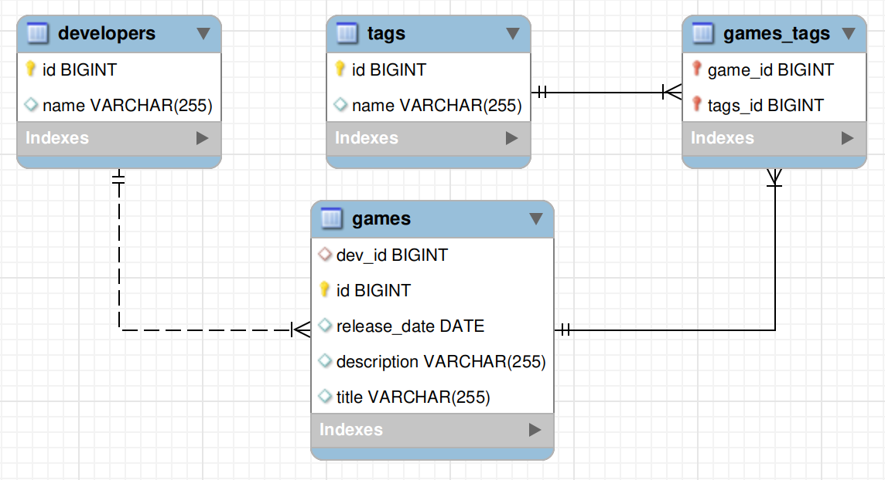
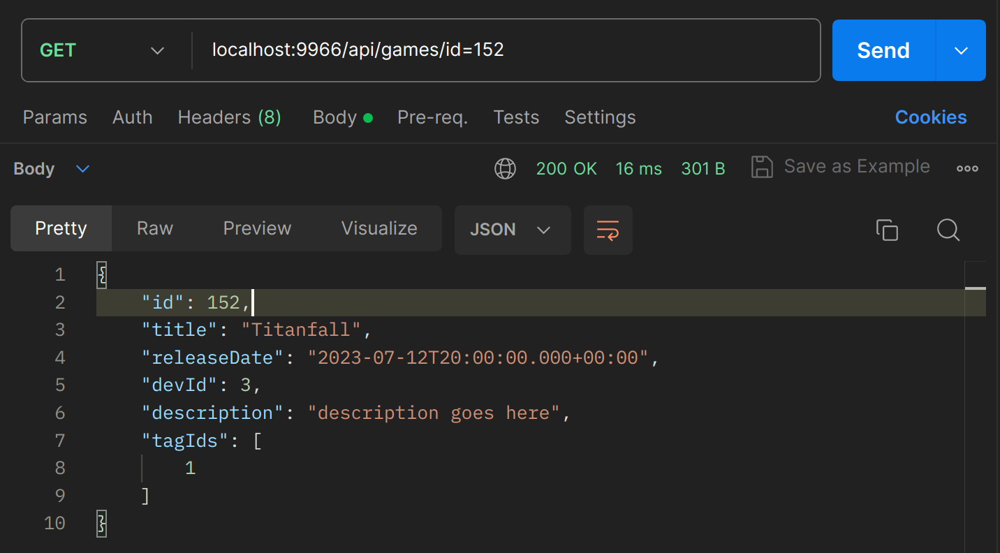
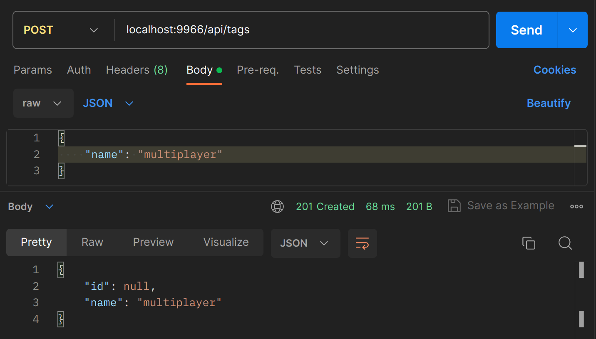
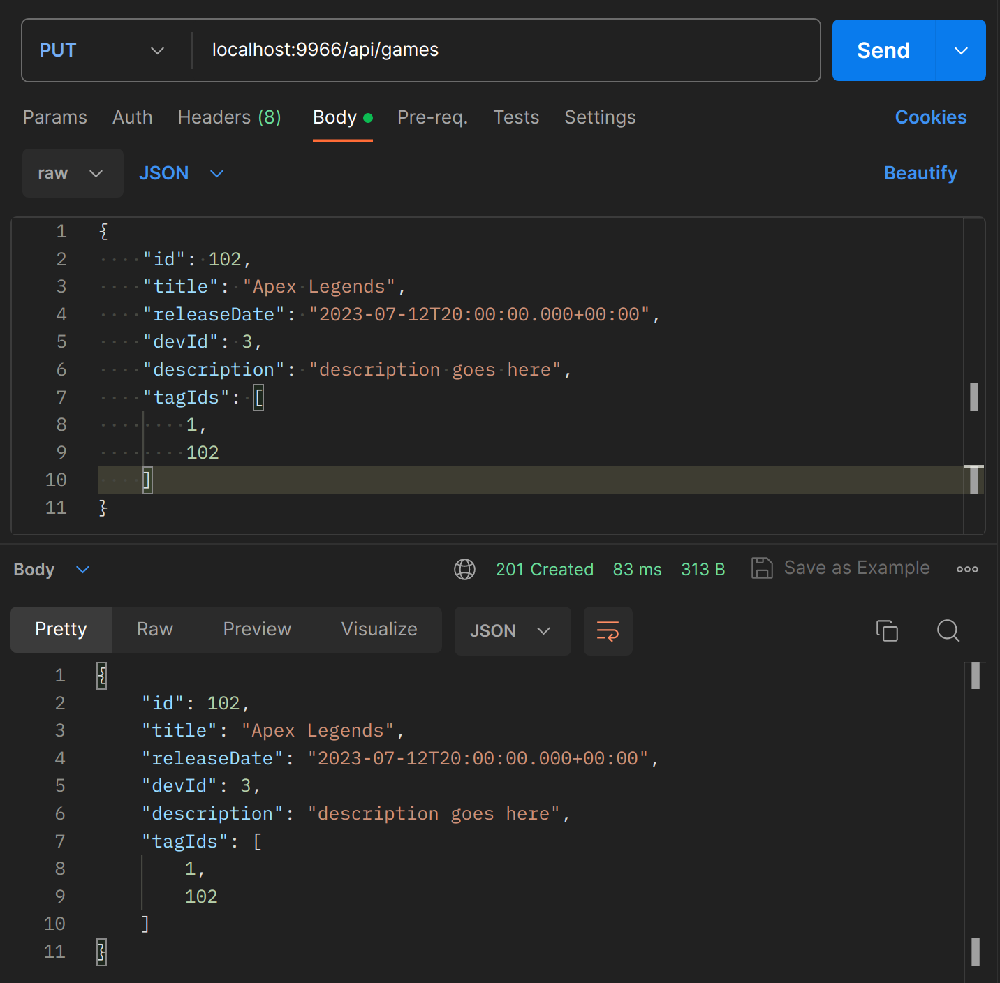
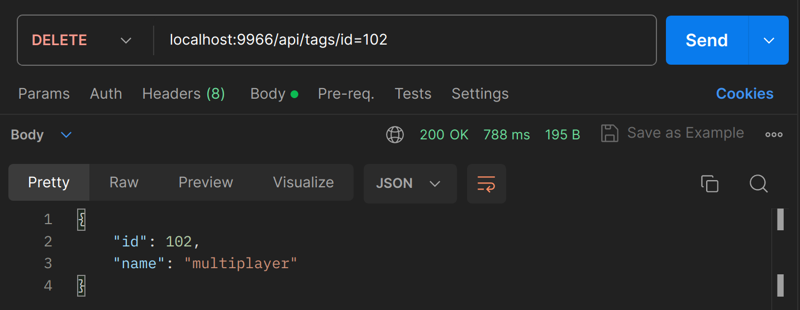

# rest-service

Задание для выполнения:

Написать RESTful сервис для хранения и взаимодействия с бизнес сущностями (сущности на свое усмотрение)

Например: список авторов с их книгами и распределение книг по жанрам.

Требования :
- Приложение написано на Spring Boot
- Взаимодействие с базой через JDBC или Hibernate
- Наличие в БД минимум 3 сущностей и связей вида один ко многим и многие ко многим
- Накат структуры БД должен быть через liquibase
- Сборка приложения с помощью Maven
- Взаимодействие осуществляется через REST запросы в формате JSON
- Дополнительно описать REST-endpoint для запроса всего списка сущностей (к примеру всех книг) с возможностью пагинации (запрос с 1 по 100 запись, с 101 по 200 и тд) с возможностью сортировки
- Коды возврата REST запросов должны возвращать соответствующие коды HTTP
 
---

### Demo

